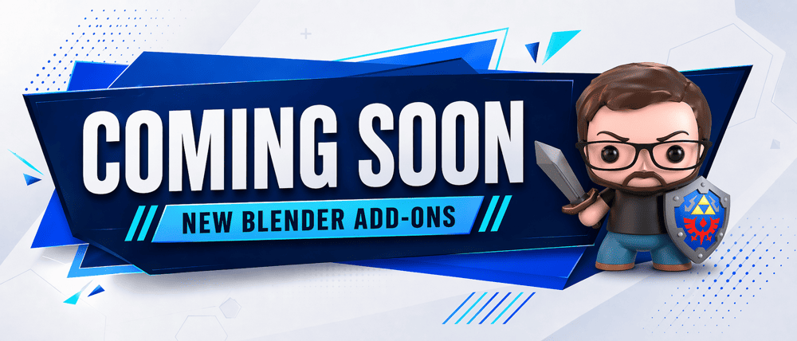

# DRH - Node Toolkit

**Planned node-editor utilities for cleanup, layout, resizing, reroute removal, color control, and graph organization**

   

  

---

## Overview

Planned node-editor utilities for cleanup, layout, resizing, reroute removal, color control, and graph organization.

This repository is the public documentation, roadmap, support, and feedback location for DRH - Node Toolkit. It does not contain an installable add-on package.

## Key features

| Capability |
|---|
| Planned node-editor utilities for cleanup, layout, resizing, reroute removal, color control, and graph organization |

## Product status

| Item | Details |
|---|---|
| Status | **Planned** |
| Version | Roadmap |
| Blender | 4.2+ |
| Platforms | To be confirmed |
| Availability | No public installable release is available yet. |
| Distribution | Planned release channel: DRH catalog / approved marketplace listing. |
| Repository role | Documentation, support, issue tracking, compatibility feedback, and product feedback |

Product direction may change before a public release.

## Media

Product screenshots and workflow previews are coming soon.

## Documentation and support

| Resource | Link |
|---|---|
| Support guide | [SUPPORT.md](SUPPORT.md) |
| Issues | [Open or review issues](https://github.com/pacosalasv/DRH_Node_Toolkit-Support/issues) |
| Discussions | [Ask questions and share feedback](https://github.com/pacosalasv/DRH_Node_Toolkit-Support/discussions) |

## Support development

Ko-fi support is optional. Contributions help fund maintenance, Blender compatibility work, documentation, testing, and continued development of free DRH tools.

  

## Ecosystem

| Destination | Link |
|---|---|
| DRH Add-ons Hub | [Catalog and roadmap](https://github.com/pacosalasv/DRH_Addons_Hub) |
| Paco Salas | DRH | [Official site](https://pacosalasv.blogspot.com/) |
| BlendKit | [DRH Blender downloads](https://www.blendkit.com/?query=author_id:205846) |
| Ko-fi | [Support development](https://ko-fi.com/pacosalasv) |

## License

No installable product is distributed from this roadmap repository. Product licensing will be stated with an approved public release.
